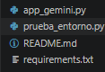
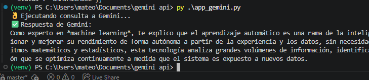
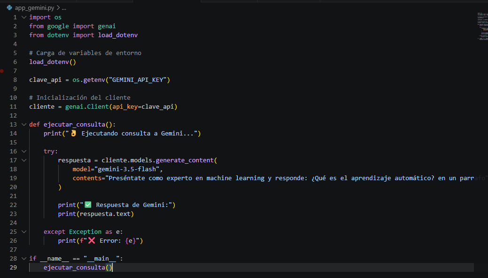

# Conexión a la API de Gemini con Python

## Descripción

Este proyecto implementa una conexión con la API de Google Gemini utilizando Python. El programa realiza una consulta al modelo de inteligencia artificial Gemini y muestra la respuesta generada en la terminal.

## Archivo principal

El archivo principal del proyecto es:

```text
app_gemini.py
```

Este script:

* Carga la clave API desde un archivo `.env`.
* Inicializa el cliente de Gemini.
* Envía una consulta al modelo Gemini.
* Recibe y muestra la respuesta generada por la IA.

## Requisitos

* Python 3.12 o superior
* Cuenta de Google AI Studio
* API Key de Gemini
* Conexión a Internet

## Instalación

### Crear entorno virtual

```bash
python -m venv venv
```

### Activar entorno virtual

```powershell
.\venv\Scripts\Activate.ps1
```

### Instalar dependencias

```bash
pip install -r requirements.txt
```

## Configuración

Crear un archivo `.env` en la raíz del proyecto:

```env
GEMINI_API_KEY=TU_API_KEY
```

## Ejecución

Ejecutar el programa principal:

```bash
python app_gemini.py
```

## Evidencias

### Evidencia 1 - Estructura del proyecto



### Evidencia 2 - Ejecución y respuesta de Gemini



### Evidencia 3 - Ejecución y respuesta de Gemini



## Autor

Mateo Echeverría
